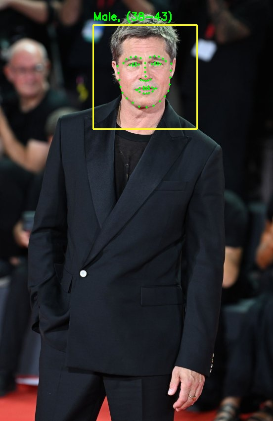
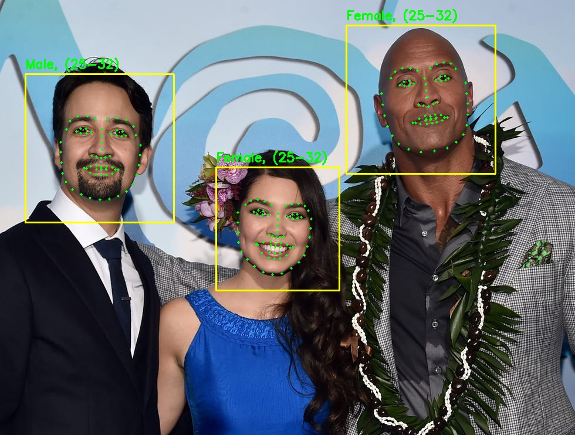

# Face Analyzer (Dockerized Version with gRPC and Redis)

This project implements a facial image analysis pipeline using gRPC services and Redis for fast memory sharing, packaged inside Docker containers for easy deployment and consistent environment setup. It detects faces, extracts landmarks, and estimates age and gender, producing annotated images and JSON results.

## 🚀 Quick Start with Docker

### Prerequisites

- Docker (version 20+ recommended)
- Docker Compose

### Setup & Run

1. **Clone the repository** (if not done yet):

```bash
git clone https://github.com/NavidAdib98/FaceAnalyzer-GRPC-Redis_Docker.git
cd FaceAnalyzer-GRPC-Redis_Docker
```

2. **Download required model files manually** (see 📦 Models section below).

3. **Configure paths using `.env`** file (already provided):

Open `.env` and set your input and output folders:

```env
INPUT_DIR=./input_images
OUTPUT_DIR=./output_images
```

4. **Build and start the containers:**

```bash
docker-compose up --build
```

This command will:

- Build images for all services
- Start Redis server
- Start aggregator, face landmark, and age-gender services
- Run the image input processing automatically

⚠️ Note: First-time Docker image build may take a few minutes.

---

## 📂 Folder Structure Inside the Container

```
/app
├── aggregator_server.py
├── face_landmark_server.py
├── age_gender_server.py
├── image_input.py
├── .env                 <-- Contains paths to input/output folders
├── models/              <-- You must mount this folder with required models
├── input_images/        <-- Mount your input images here
├── output_images/       <-- Processed results will be saved here
```

## 🧠 Output

- Annotated images with detected faces, landmarks, age, and gender labels.
- JSON files containing detailed information per image.

---

## 📦 Models

Due to GitHub size limits, model files are **not included**.

Please download and place these manually in your local `models/` folder:

- `shape_predictor_68_face_landmarks.dat` → `models/`
- `age_net.caffemodel` → `models/age-model/`
- `gender_net.caffemodel` → `models/gender-model/`

Make sure the structure is as follows:

```
models/
├── shape_predictor_68_face_landmarks.dat
├── age-model/
│   └── age_net.caffemodel
└── gender-model/
    └── gender_net.caffemodel
```

---

## 🖼️ Input and Output Examples

Put your input images in `input_images/`:

```
input_images/
├── SingleFace.jpg
└── GroupPhoto.png
```

After running, results will appear in `output_images/`:

```
output_images/
├── SingleFace_result.jpg
├── GroupPhoto_result.jpg
├── SingleFace.json
└── GroupPhoto.json
```

### 📷 Sample Input/Output

**Input:**



**Output:**



> 😄 Sometimes the model gets playful and guesses the wrong gender—don't take it personally!

---

## 📝 Notes

- This version avoids all manual Python/C++ dependency headaches.
- The services run automatically and stop after all images are processed.
- Redis is used for fast inter-service communication.

---
